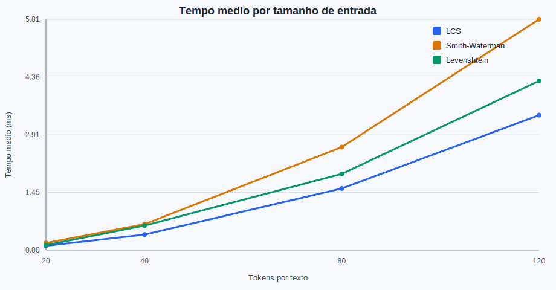

# Detector de Plagio com Programacao Dinamica

Sistema para comparar dois textos usando algoritmos classicos de Programacao Dinamica. O projeto mede similaridade, reconstrucao de alinhamentos e exibicao visual de trechos correspondentes.

## Recursos

- Pre-processamento por palavra ou linha.
- LCS para alinhamento global.
- Smith-Waterman para alinhamento local.
- Levenshtein para distancia de edicao.
- Relatorios HTML com trechos destacados.
- Interface Streamlit com textos lado a lado e matriz DP.
- CLI para execucao em terminal.

## Instalacao

```bash
python -m pip install -r requirements.txt
```

## Interface Grafica

```bash
python -m streamlit run src/app.py
```

Na interface, selecione o algoritmo, carregue dois arquivos ou cole os textos manualmente. A tela mostra a similaridade, contagem de tokens, correspondencias encontradas, textos destacados lado a lado e a matriz de Programacao Dinamica.

## CLI

```bash
python -m src.cli data/wiki_original.txt data/wiki_plagio.txt --algoritmo lcs
```

Gerando relatorio HTML:

```bash
python -m src.cli data/wiki_original.txt data/wiki_plagio.txt --algoritmo smith-waterman --saida-html relatorio.html
```

Opcoes principais:

- `--algoritmo`: `lcs`, `smith-waterman` ou `levenshtein`.
- `--modo`: `word` ou `line`.
- `--manter-stopwords`: preserva stopwords no modo `word`.
- `--saida-html`: grava um relatorio HTML com highlights.

## Testes

```bash
python -m pytest
```

## Benchmarks

Os resultados abaixo foram gerados com entradas sinteticas de 20, 40, 80 e 120 tokens por texto, repetindo cada medicao cinco vezes e registrando o tempo medio em milissegundos.

```bash
python scripts/benchmark.py --output-dir docs
```



Dados brutos: [docs/benchmark_tempo.csv](docs/benchmark_tempo.csv)

## Observacoes

LCS e Smith-Waterman retornam alinhamentos usados para highlights. Levenshtein retorna a distancia minima de edicao e uma similaridade normalizada baseada nessa distancia.
